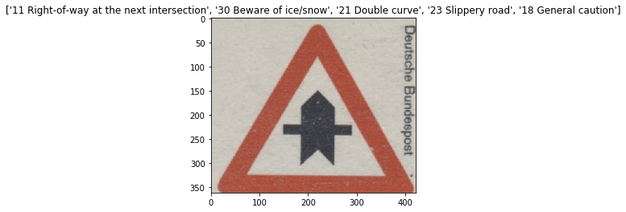
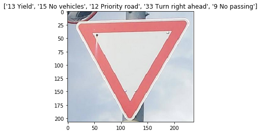
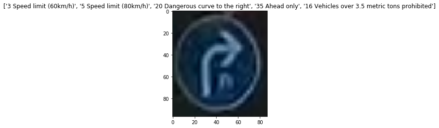
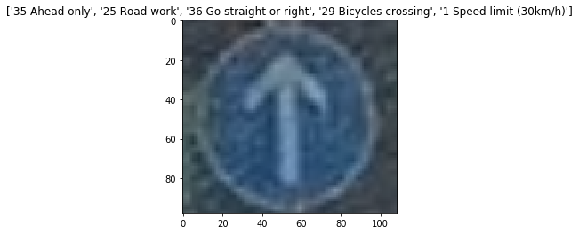
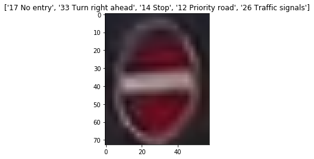

# Traffic Sign Classifier 

## Objective 

- Create a image classifier that classifes traffic signs of German traffic signs 

## Data 

- Used German Transportation Data Set  
    - http://benchmark.ini.rub.de/?section=gtsrb&subsection=dataset
    - 43 classes  (not evenly distributed)
    - 50 K samples 
    - 32 x 32, colored (RGB)

## Methodologies

- Used CNN (LeNet 5) network as the classfier. The structure is as below: 
    - Conv2D: kernel 5x5, output dimension = 6, max pooling 2x2, no padding
    - Conv2D: kernel 5x5, output dimension = 16, max pooling 2x2, no padding
    - Fully Connected: output 120, with ReLu activation
    - Fully Connected: output 84, with Relu activation
    - Fully connected: output 43

- Preprocessed with grayscaling and normalization ([0-255] -> [0.0-1.0])
- Evaluated using cross entropy and used Tensorflow
- Among 50 K samples, used 35 K samples for training, and 4.4 K samples for validation (other 12.6 K are not used)

## Results 
- With validate dataset, the accuracy reached 93%
- With 5 test images that are collected from the web, 5 among 5 (100%) images are rightly classified

## Test Samples 

- The caption suggest top 5 results of the classification. Left is the class with most probable (the accuracy mentioned is based on the left one)

      
      
      
      
      

## Note
- The result is accurate when the image is rightly cropped. When the cropping is not appropriate (for example, not located in the center or there is too much blank space), the accuracy became low. 

