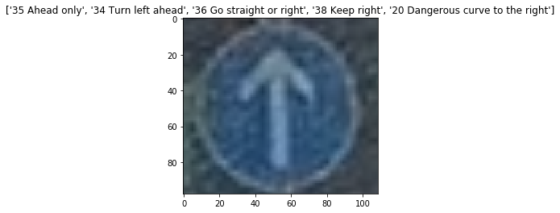
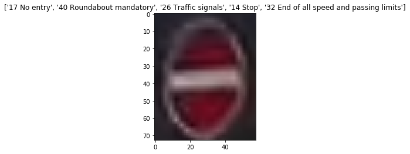

# Traffic Sign Classifier 

## Objective 

- Create a image classifier that classifes traffic signs of German traffic signs 

## Data 

- Used German Transportation Data Set  
    - http://benchmark.ini.rub.de/?section=gtsrb&subsection=dataset
    - 43 classes  (not evenly distributed, as shown in the chart below)
    - 50 K samples 
        - splitted into training: 35 K, validation 4.4 K and test 12.6 K
    - 32 x 32 x 3 colored (RGB)

 
    

 Example images

## Methodologies

- Used CNN (LeNet 5) network as the classfier. The structure is as below: 
    - Conv2D: kernel 5x5, output dimension = 6, max pooling 2x2, no padding
    - Conv2D: kernel 5x5, output dimension = 16, max pooling 2x2, no padding
    - Fully Connected: output 120, with ReLu activation
    - Fully Connected: output 84, with Relu activation
    - Fully connected: output 43

- Preprocessed with grayscaling and normalization ([0-255] -> [0.0-1.0])
    - grayscaling is to simplify the data and based on an assumption that the color is not significantly important, but the shape is
    - normlaization is to improve the efficiency of training
- Evaluated using cross entropy and used Tensorflow
- Among 50 K samples, used 35 K samples for training, and 4.4 K samples for validation (other 12.6 K are not used)

- Training settings are asbelow: 
    - optimizer: Adam (with learning rate: 0.0001)
    - batch size: 128
    - epoch: 100

## Results 
- With validate dataset, the accuracy reached 93%
- With 5 test images that are collected from the web, 5 among 5 (100%) images are rightly classified

## Test Samples 

- The caption suggest top 5 results of the classification. Left is the class with most probable (the accuracy mentioned is based on the left one)

      
    
scores of each class
- Right-of-way at the next intersection :	  1.0
- Beware of ice/snow :	  1.22535e-08
- Double curve :	  1.1739e-08
- Slippery road :	  4.95268e-10
- General caution :	  1.25591e-13

  

- Yield :	  1.0
- No vehicles :	  7.89726e-09
- Priority road :	  1.76288e-10
- Turn right ahead :	  1.62565e-10
- No passing :	  4.12032e-11

  

- Speed limit (60km/h) :	  0.569374
- Speed limit (80km/h) :	  0.0882857
- Dangerous curve to the right :	  0.0839292
- Ahead only :	  0.0716644
- Vehicles over 3.5 metric tons prohibited :	  0.0647315
   
  

- Ahead only :	  1.0
- Turn left ahead :	  2.54822e-07
- Go straight or right :	  1.52265e-07
- Keep right :	  2.96871e-09
- Dangerous curve to the right :	  1.14092e-10
   
  

- No entry :	  1.0
- Roundabout mandatory :	  4.16193e-11
- Traffic signals :	  4.32302e-15
- Stop :	  3.56684e-15
- End of all speed and passing limits :	  2.78163e-15

## Comments
- It is observed that all except for the third one is classified well with quite high confidence level. 
- It isconsidered that the third one has a small white line inside the sign. This line may confuse the classifer
- Except for this kind of line, the classifier, it was found that (not shown here thought), if the signs are not cropped well (ex. located in the edge of the image) the classification score is not good 
- Difference of size does not affect the result, because the images are resized when feeding into the model 

